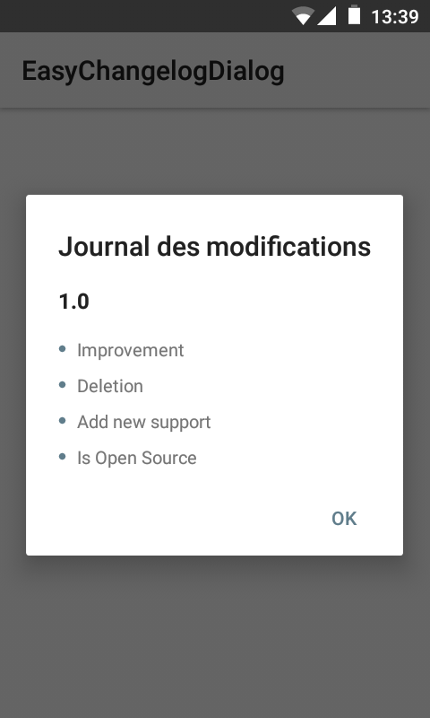

# EasyChangelogDialog

### Description
EasyChangelogDialog is a library that allows you to display a change log dialog, this library is extremely easy to use

### Screenshot


### Get Library
To get the library copy the ```EasyChangelogeDialogLibrary``` folder to your project

### Use
* First, note this import into your activity

```gradle
import com.msay2.changelogeedialoglibrary.dialog.DialogChangelog;
```

* Second, create a private variable that will contain all your writings

```gradle
String[] changelog = getResources().getStringArray(R.array.changelogs);
```
or
```gradle
String[] changelog = {"Improvement", "Deletion", "Add new support", "Is Open Source"};
```

* Thirdly Go to ```res/values/``` and create ```arrays.xml``` and write in file 

```gradle
<string-array name="changelogs">
	<item><![CDATA["Hello text is "<b>Bold</b>""]]></item>
	<item><![CDATA["Hello text is "<u>Underline</u>""]]></item>
	<item><![CDATA["Hello text is "<i>Italic</i>""]]></item>
	<item><![CDATA["Hello text is Normal"]]></item>
	<item>"Hello text is Normal"</item>
</string-array>
```

* Fourth Go to ```MainActivity``` and write in ```onCreare``` method

```gradle
DialogChangelog.getDialogChangelog(this, DialogChangelog.Data.getDatas(changelog));
```
* Look at an example of use [MainActivity.java](https://github.com/MSay2/EasyChangelogDialog/blob/master/app/src/main/java/com/msay2/changelogdialog/MainActivity.java)

### More informations
The ```getDialogChangelog()``` method will automatically detect if your application plays on a new version and will display accordingly, everything is automated for you.
The ```getDialogManual()``` Allows you to call the change log manually

### Clone Git Repository
Please refresh the project so that it can work !

# License

```
Copyright 2017 MSay2

Licensed to the Apache Software Foundation (ASF) under one or more contributor
license agreements. See the NOTICE file distributed with this work for
additional information regarding copyright ownership. The ASF licenses this
file to you under the Apache License, Version 2.0 (the "License"); you may not
use this file except in compliance with the License. You may obtain a copy of
the License at

   http://www.apache.org/licenses/LICENSE-2.0

Unless required by applicable law or agreed to in writing, software
distributed under the License is distributed on an "AS IS" BASIS, WITHOUT
WARRANTIES OR CONDITIONS OF ANY KIND, either express or implied. See the
License for the specific language governing permissions and limitations under
the License.
```
